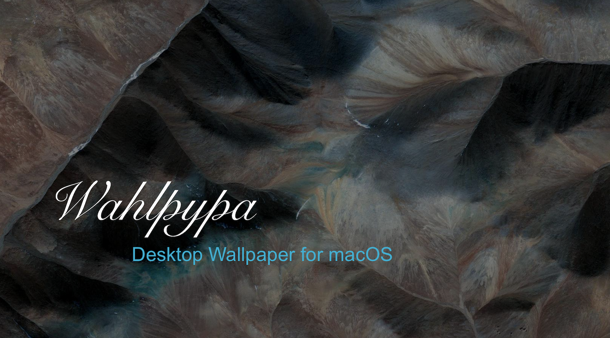

Wahlpypa: Satellite Landscapes from Google Earth
================================================

**Note**: This project is a work in progress. However, it is a good starting point for
getting the job done on macOS. There are many things that could be improved. Pull requests
are welcome.

## Quick Start
1. Clone the repository
2. Install the dependencies
3. Run the script

## Setting up Automatically Changing Wallpapers in macOS
1. Open 'System Preferences' from the  Apple menu
2. Select 'Desktop & Screen Saver'
3. Click the 'Desktop' tab and pick 'fill screen' from the dropdown
4. Click the [+] button and add the `/img` directory from this repo
5. Enable 'Change picture' and set a time interval
6. Enable the 'Random order' checkbox for best results

## Extra Credit
1. Set the values in the `config.ini` file to your liking.
2. Add a cron job to update the set of wallpaper images automatically.
